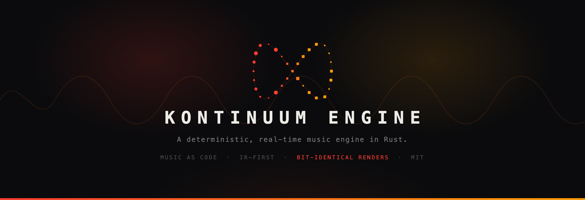

<p align="center">
  
</p>

<p align="center">
  Music is code: a validated IR describes the whole session, a compiler turns it
  into audio blocks, and a lock-free render core performs them sample-accurately
  on the audio thread. <strong>The same seed always produces the same music.</strong>
</p>

<p align="center">
  <a href="https://github.com/Kontinuum-ai/kontinuum-engine/actions/workflows/ci.yml"></a>
  
  
  <a href="LICENSE"></a>
  <a href="https://factory0.ventures"></a>
</p>

<p align="center">
  <sub>
    <a href="https://kontinuum.audio">kontinuum.audio</a> &nbsp;·&nbsp;
    <a href="https://github.com/Kontinuum-ai">the project</a> &nbsp;·&nbsp;
    <a href="docs/">docs</a>
  </sub>
</p>

---

## Why this exists

Kontinuum is a generative-music product with one hard rule: **the engine never
guesses**. Every musical decision is data in a versioned IR, every change to
that IR passes a validator before it can sound, and every render is a pure
function of `(session, seed)`. This repository is that engine, extracted and
open: the synthesis core, the musical language, the arrangement brain, the
mastering chain, and the offline renderer that CI holds to bit-identical
repeats.

No server. No cloud calls. No hidden state. Clone it, run the tests, and the
numbers are yours to check.

## Quick start

```sh
git clone https://github.com/Kontinuum-ai/kontinuum-engine
cd kontinuum-engine
cargo test --workspace        # the full gate: determinism, validation, golden pins
cargo run -p kontinuum-ir -- render fixtures/loop-4track.ir.json demo.wav
open demo.wav                 # a four-track techno loop, rendered offline
```

Every test run re-renders fixture sessions and asserts the bytes match. Change
one DSP line and a golden pin tells you exactly which pin moved and why.

## What is in the box

| Layer | Crate | What it does |
|---|---|---|
| Musical language | `kontinuum-ir` | The session IR: schema, bounds validator, diff mutations, compiler. JSON is canonical; every editor and the composer write through validated diffs |
| Time | `kontinuum-clock`, `kontinuum-schedule` | Tempo lanes, PPQ transport, compiled audio blocks, SPSC hand-off to the audio thread |
| Sound | `kontinuum-core`, `kontinuum-mastering` | The DSP graph: voices, FX, 12-track mixer, the mastering chain. Allocation-free on the render path |
| Instruments | `kontinuum-plugin-api`, `kontinuum-instruments-core` | The plugin seam plus 12 first-party voices (kick, acid, pads, granular sampler, …) |
| Composition | `kontinuum-compose`, `kontinuum-composer` | Arrangement engine (sections, energy curves, transitions), seeded generators, and a backend-agnostic planning layer: on-device heuristic first, LLM optional |
| Safety | `kontinuum-supervision` | Watchdog, fallback arrangement, kill-switch counters: the AI is contained |
| Evidence | `kontinuum-analysis`, `kontinuum-corpus` | The self-listening critic: LUFS, crest, spectral tilt, per-band energy, groove metrics, regression ratchets |
| Delivery | `kontinuum-offline`, `kontinuum-export`, `kontinuum-bridge` | Deterministic IR-to-WAV rendering, masters, and the live engine facade behind the C FFI |

`docs/MUSIC-AS-CODE.md` is the architecture document: the Score → expand →
Performance → compile → render pipeline, and why expansion is pure, seeded, and
never runs on the audio thread.

## The determinism contract

- Audio is a pure function of `(session, seed)`. No ambient entropy, no clock
  reads on the render path.
- Run-to-run renders are **bit-identical**; CI fails otherwise.
- The golden hash pin is host-canonical (transcendentals resolve to the
  platform libm), so the pin is asserted on the owning host via
  `KONTINUUM_GOLDEN_PIN_CHECK=1`; every host still gates the portable
  guarantees: run-to-run identity, finite/audible output, WAV round-trip.
- New sound is only allowed through a review that re-pins deliberately. The
  pin's changelog is the sound's audit trail.

## The critic watches the sound

`kontinuum-analysis` scores every render: loudness, crest, spectral tilt,
band energies, masking, per-hit variation, groove consistency. Regression
ratchets fail CI when a change moves the numbers the wrong way. The engine
listens to itself before you have to.

## Repository layout

```
ir/         the IR crate: schema, validator, diffs, compiler, CLI
engine/     15 crates: clock, schedule, core, mastering, compose, composer,
            supervision, analysis, samples, taste, preference, corpus,
            offline, export, bridge
plugins/    the plugin API + first-party instruments
fixtures/   IR sessions incl. the adversarial validation corpus
docs/       MUSIC-AS-CODE.md, critic metrics, A/B protocol, design language
scripts/    reachability gate, reference-profiling tooling
```

## Contributing

PRs welcome. The house rules are short:

- **IR first**: schema → validator → compiler → engine → surface. A feature
  with no IR representation does not exist yet.
- **One write path**: every mutation of a session goes through a validated
  diff.
- **Determinism is a gate, not a vibe**: if your change moves a golden pin,
  say so in the pin's changelog entry and say why.
- `cargo test --workspace` and `./scripts/check-reachability.sh` must be green.

## License

MIT. See [LICENSE](LICENSE).
